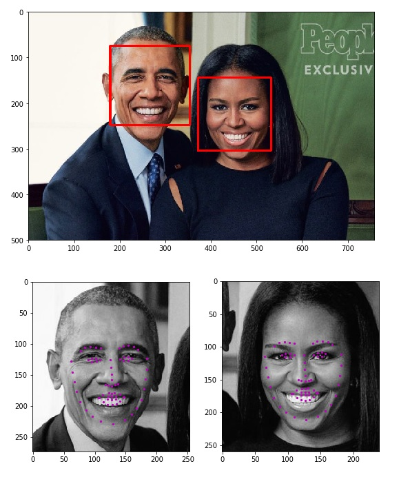
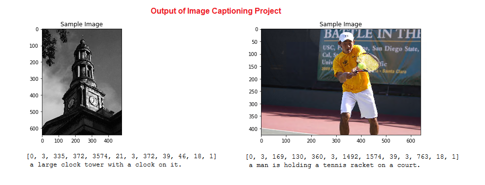

# Udacity Computer Vision Nanodegree
This repository contains projects completed in the Udcity's Computer Vision Nanodegree program as a part of **Secure and Private AI Scholarship Challenge from Facebook - 2019** (SPAIC)

## Projects

### Facial Keypoint Detection
>[P1_Facial_Keypoints](https://github.com/govind-savara/CVND/tree/master/P1_Facial_Keypoints)

Applying knowledge of image processing and deep learning to create a CNN for facial keypoints (eyes, mouth, nose, etc.,) detection.

### Image Captioning
>[P2_Image_Captioning](https://github.com/govind-savara/CVND/tree/master/P2_Image_Captioning)

Using Neural Network architecture (a CNN-RNN model) to automatically generate captions from images. The main task is to implement an effective RNN decoder for a CNN encoder.

### Landmark Detection & Robot Tracking (SLAM)
>[P3_Landmark_Detection_Robot_Tracking_(SLAM)](https://github.com/govind-savara/CVND/tree/master/P3_Landmark_Detection_Robot_Tracking_(SLAM))

In this project implemented SLAM, a robust method for tracking an object over time and mapping out its surrounding environment, using elements of probability, motion models, and linear algebra.

Below is an example of a 2D robot world with landmarks (purple x's) and the robot (a red 'o') located and found using only sensor and motion data collected by that robot. 
This is just one example for a 50x50 grid world; in our project work we will likely generate a variety of these maps.

/images/robot_world.png)