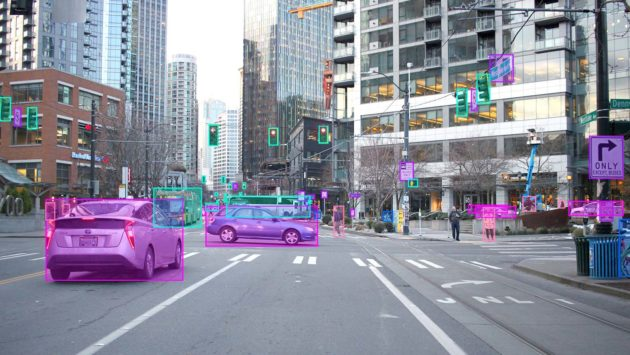

# Udacity Computer Vision Nanodegree
This repository contains projects completed in the Udcity's Computer Vision Nanodegree program as a part of **Secure and Private AI Scholarship Challenge from Facebook - 2019** (SPAIC)

## Projects

### [Facial Keypoint Detection] (https://github.com/govind-savara/CVND/blob/master/P1_Facial_Keypoints)
Applying knowledge of image processing and deep learning to create a CNN for facial keypoint (eyes, mount, nose, etc.,) detection.

